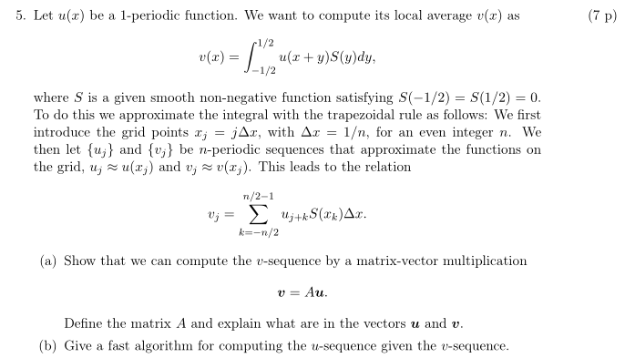

## Exercises 3, 5, 6c from the exam 250310

### Exercise 3

#### Step 1: Determining the number of clusters
The multiplicity of $\lambda = 0$ tells us how many connected components the graph has.    
Here $\lambda_1 = 0.000$ and the $\lambda_2$ and $\lambda_3$ are relatively close to $0$. This means we have $3$ weakly connected groups of nodes that could be separated into $3$ clusters (nodes are more likely to be connected if they are close to each other). 

We can also confirm that, seeing the subsequent growing eigenvalues - attempting to split the graph into more clusters would force partitioning among more and more strongly interconnected nodes. 

#### Step 2: Clustering
The first eigenvector $x_1$ is constant indicating the graph is connected. The vectors $x_2$ and $x_3$ however, these capture structural information that can be used to embed nodes into a 2D space. Representing each point as $(x_2(i), x_3(i))$ where $i$ is the node index, one could then apply k-means with $k=3$ to assign each node to a corresponding cluster.

Since the proximity of the respective coordinates can be easily assessed visually in our case, we can conclude that the appropiate clusters are:
- Cluster 1: $i = \{1, 4, 9, 10\}$
- Cluster 2: $i = \{2,3,6,8\}$
- Cluster 3: $i = \{5,7,11,12\}$

### Exercise 5a

#### Step 1: Vectors $\boldsymbol{u}$ and $\boldsymbol{v}$
Since $\{u_j\}$ and $\{v_j\}$ are n-periodic sequences, for matrix multiplication they can be represented as vecotrs of length $n$,
where:
- $\boldsymbol{u}$: contains discrete samples of the original 1-periodic function $u(x)$ taken at the grid points:
$$
\boldsymbol{u} = [u_0, u_1, \dots, u_{n-1}]^T, \quad u_j \approx u(x_j),  
$$
- $\boldsymbol{v}$: stores local averages of $u$ around each point $x_j$ (each computed with the expression for $v_j$ given in the task):
$$
\boldsymbol{v} = [v_0, v_1, \dots, v_{n-1}]^T, \quad v_j \approx v(x_j).  
$$

#### Step 2: Matrix $A$
The periodic nature of the problem suggests that $A$ should be a circulant matrix.       

We have:

$$
v_j = \sum_{k = -n/2}^{n/2 - 1} u_{j+k} S(x_k) \Delta x,
$$

where: 
- $x_k = k \Delta x$, 
- $\Delta x = 1/n$, 
- $n$ is even, 
- $S$ is a smooth, non-negative function with $S(-1/2) = S(1/2) = 0$, 
- $\{u_j\}$ is n-periodic ($u_j = u_{j \pm n}$),
- $k \in (-\frac{n}{2}, \dots, \frac{n}{2}-1)$ - the range of size $n$ 

We will try to transform this expression into a matrix-vector product $v=Au$. To do so we will:
- replace the summation over $k$, with summation over $m = j+k$,
- this implies changing the $x_k$ into $x_{(m-j)}$.

Thus we obtain:
$$
v_j = \sum_{m = j-n/2}^{j + n/2 - 1} u_{m} S(x_{(m-j)}) \Delta x
$$

Since $u_m$ is implicitely n-periodic ($u_m = u_{m \pm n}$), we can wrap $m$ around a shifted range of the same size, $(0, \dots, n-1)$, that can serve as matrix indices. However $S(x_k)$ is not periodic, thus we must ensure $k=(m-j)$ is properly mapped to to original range of $k$.

To achieve this we rewrite to expression as:

$$
v_j = \sum_{m=0}^{n-1} u_m S(x_{k'(j, m)}) \Delta x,
$$

where $k'(j, m)$ is defined such that:

$$
k'(j, m) = 
\begin{cases} 
m - j & \text{if } -\frac{n}{2} \leq m - j < \frac{n}{2}, \\
m - j - n & \text{if } m - j \geq \frac{n}{2}, \\
m - j + n & \text{if } m - j < -\frac{n}{2}.
\end{cases}
$$   

This form allows us to directly formulate the matrix $A$ elements as:

$A_{j,m} = S\left( x_{k'(j, m)} \right) \Delta x$,

where $x_{k'} = k' \Delta x$, and $j, m = 0, 1, \dots, n-1$.

The matrix $A$ is circulant and each of its rows is a cyclic shift of the previous row. Thus it can be defined by a single row, e.g. for $j = 0$ (the first row):

$$
A_{0,m} = S\left( x_{k'(0, m)} \right) \Delta x
=
\left[ S(x_0), S(x_1), \dots, S\left(x_{\frac{n}{2} - 1}\right), S\left(x_{-\frac{n}{2}}\right), S\left(x_{-\frac{n}{2} + 1}\right), \dots, S(x_{-1}) \right] \Delta x
$$

The full matrix $A$ is then:

$$
A = \Delta x \begin{bmatrix}
S(x_0) & S(x_1) & \cdots & S(x_{\frac{n}{2}-1}) & S(x_{-\frac{n}{2}}) & \cdots & S(x_{-1}) \\
S(x_{-1}) & S(x_0) & \cdots & S(x_{\frac{n}{2}-2}) & S(x_{\frac{n}{2}-1}) & \cdots & S(x_{-2}) \\
\vdots & \vdots & \ddots & \vdots & \vdots & \ddots & \vdots \\
S(x_1) & S(x_2) & \cdots & S(x_{\frac{n}{2}-1}) & S(x_{-\frac{n}{2}+1}) & \cdots & S(x_0)
\end{bmatrix},
$$

and the product $\boldsymbol{v} = A \boldsymbol{u}$ is:

$$
\boldsymbol{v} = \begin{bmatrix}
\sum_{m=0}^{n-1} u_m S\left( x_{k'(0, m)} \right) \Delta x \\
\sum_{m=0}^{n-1} u_m S\left( x_{k'(1, m)} \right) \Delta x \\
\vdots \\
\sum_{m=0}^{n-1} u_m S\left( x_{k'(n-1, m)} \right) \Delta x
\end{bmatrix}.
$$

As shown above, each element $v_j$ of $\boldsymbol{v}$ corresponds directly to the expression for $v_j$ from the problem definition.

### Exercise 5b

1. Get the first column $\boldsymbol{z}$ of $A$ $\rightarrow$ complexity $\mathcal{O}(n)$.
2. Compute eigenvalues $\boldsymbol{\lambda} = \text{FFT}(\boldsymbol{z})$ $\rightarrow$ complexity $\mathcal{O}(n \log n)$.
3. Compute $\boldsymbol{v'} = \text{FFT}(\boldsymbol{v})$ $\rightarrow$ complexity $\mathcal{O}(n \log n)$.
4. Now in frequency-domain, compute $\boldsymbol{u'} = \boldsymbol{v'} \mathbin{\mathtt{./}} \boldsymbol{\lambda}$ (element-wise division) $\rightarrow$ complexity $\mathcal{O}(n)$.
5. Apply inverse FFT to go back to time-domain: $\boldsymbol{u} = \text{IFFT}(\boldsymbol{u'})$ $\rightarrow$ complexity $\mathcal{O}(n \log n)$.

Total complexity dominated by the FFT steps, i.e. $\mathcal{O}(n \log n)$.

### Exercise 6c

